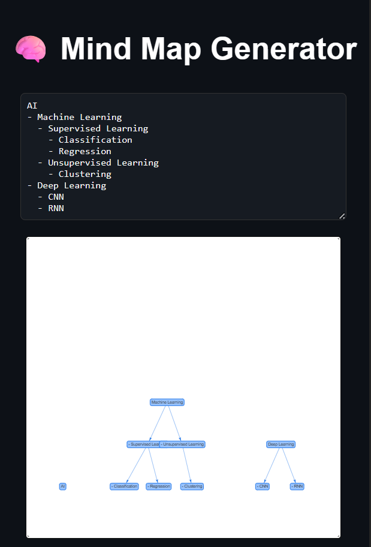

# 🧠 Mind Map Generator from Notes

A smart React app that turns your indented plain text notes into an interactive mind map using vis-network. Perfect for visual learners, students, and frontend-focused devs.

---

## ✨ Features

- Convert indented text into real-time visual mind map
- Auto-detects hierarchy and draws connections
- Clean UI and responsive layout
- Zoom, drag, and interact with nodes

---

## 🧰 Tech Stack

- ReactJS
- vis-network
- CSS

---

## 📋 Example Input Format

Paste notes like this into the app:

AI

Machine Learning

Supervised Learning

Classification

Regression

Unsupervised Learning

Clustering

Deep Learning

CNN

RNN

> The app will auto-generate a mind map based on indentation.

---

## 🧠 Use Cases

- Students visualizing study topics
- Teams brainstorming ideas
- Frontend devs showing parsing + rendering skills
- Interview take-home or resume booster project

---

## 🚀 Setup Instructions

git clone https://github.com/your-username/mind-map-generator.git
cd mind-map-generator
npm install
npm start

> Then open http://localhost:3000 in your browser.

---

💡 Why This Project Stands Out

Demonstrates tree parsing logic

Uses vis-network for real-world data viz

Not a CRUD clone — built from scratch

Clean, interactive, useful

---

📝 Future Improvements

Save/export mind map as image or PDF

Add color styles to nodes by depth

Markdown or .txt upload support

Export/load saved mind maps

---

📄 License

MIT License – free to use, improve, and share.

---

🙌 Author

Built by @SkAlthafAhmed

---
